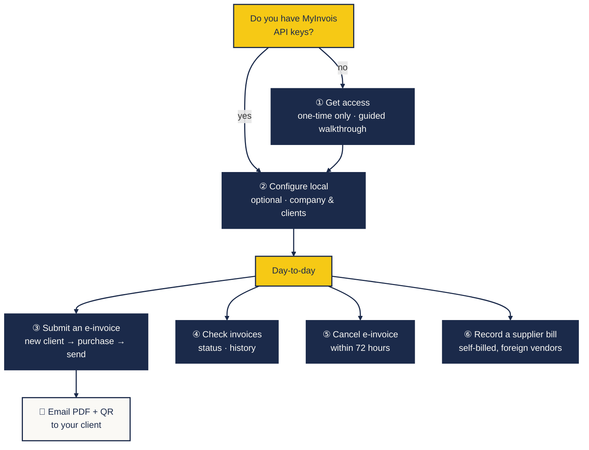
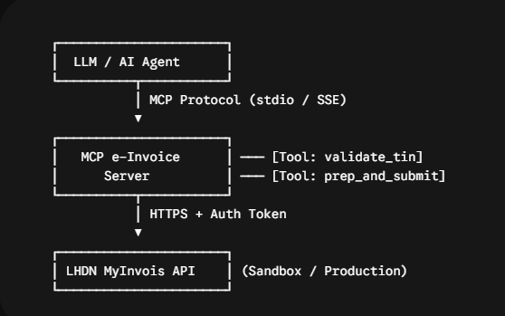
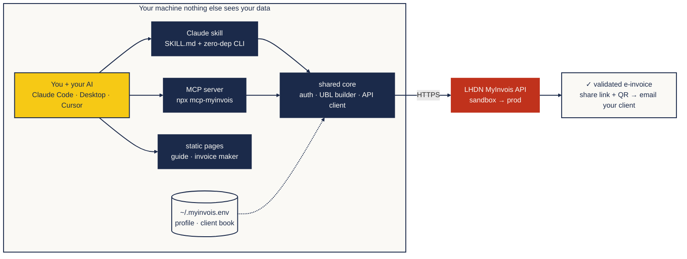

<p align="center">
  
</p>

# Malaysia e-Invoice (MyInvois)  for humans and their AI

Talk to Claude, get a validated LHDN e-invoice. This repo gives your AI the
skill + MCP tools to handle the whole journey  getting API access on the
hasil.gov.my portal, keeping your company & client records, submitting, and
sending the result to your customer.

> Unofficial · not affiliated with LHDN · you are responsible for your own tax
> submissions. Sandbox by default  nothing touches production unless you opt in.

## Where are you in the journey?

> [!NOTE]
> This repository includes specific skill prompts for AI agents (like Claude, Cursor, or browser-use). Add them to your AI's context for perfect task execution.

| Skill File | Purpose | Automation |
| --- | --- | --- |
| `skills/einvois-get-access.md` | Parent skill: get API credentials (links to 1 & 2) | `browser-use`, `playwright` |
| `skills/einvois-get-access-1.md` | MyTax portal: login, company role & role application | `browser-use`, `playwright` |
| `skills/einvois-get-access-2.md` | MyInvois: ERP registration, key capture & verify | `browser-use`, `playwright` |
| `skills/einvois-configure.md` | Configure company & client details | `browser-use`, `playwright` |
| `skills/einvois-create-einvoice-submit.md` | Generate and submit e-invoices | Data extraction |
| `skills/einvois-create-einvoice-fe-for-client.md` | Build client-facing UI for invoices | UI Generation |




**Open a journey:**
[① get access](https://techtemplemy.github.io/mcp-myinvois/guide-access.html) ·
[② configure & setup](https://techtemplemy.github.io/mcp-myinvois/guide-configure.html) ·
[③ submit](https://techtemplemy.github.io/mcp-myinvois/guide-submit.html) ·
[④ check](https://techtemplemy.github.io/mcp-myinvois/guide-check.html) ·
[⑤ cancel](https://techtemplemy.github.io/mcp-myinvois/guide-cancel.html) ·
[⑥ self-billed](https://techtemplemy.github.io/mcp-myinvois/guide-selfbill.html)

Each step below has a **copy-paste prompt for Claude** and a no-AI fallback.
Prefer clicking through screens? The **[visual guide hub](https://techtemplemy.github.io/mcp-myinvois/setup-guide.html)**
has one page per journey ①–⑤, each opening with the same copy-paste Claude prompt.

---

## ① Get access  you have no API keys yet *(one-time only)*

> 💬 **Say to Claude:** *"Use the myinvois skill. I'm new to Malaysia e-invoicing 
> get me MyInvois sandbox API access for my company, step by step. Open the
> portal pages for me as we go."*

Claude walks you through the LHDN portal (it can open the hasil.gov.my pages
in a browser alongside you), warns you about the two traps everyone hits
(registering under your *personal* profile instead of the company; clock-skew
rejections), saves your keys to `~/.myinvois.env`, and proves the connection
with a live token call.

*No AI?* Follow the [get-access page](https://techtemplemy.github.io/mcp-myinvois/guide-access.html)  mock portal screens plus a `.env` generator.

## ② Configure local *(optional)*

> 💬 **Say to Claude:** *"Use the myinvois skill. I already have my MyInvois
> client ID and secret  set up my credentials, my company profile, and my
> client book."*

Claude collects your seller details (TIN, BRN, MSIC, address), **validates your
TIN against LHDN live**, and writes two small local files that every future
invoice reuses: `~/.myinvois-profile.json` (you) and `~/.myinvois-clients.json`
(who you bill). Nothing is stored anywhere else.

*No AI?* The [configure page](https://techtemplemy.github.io/mcp-myinvois/guide-configure.html) has in-browser generators for both files.

## ③ Submit an e-invoice

**a  new client?**
> 💬 *"Save a new client: COHNTOH Sdn Bhd, BRN 201901234567  look up and validate
> their TIN first."*  → MCP: `search_tin` → `validate_tin` → client book.

**b  the purchase / invoice itself**
> 💬 *"Here's my invoice PDF  submit it to MyInvois. Show me the summary before
> sending."*  (or just describe the line items in chat)

Your AI extracts buyer + lines, builds the UBL document from your profile,
**always shows you a summary and waits for your yes** (`draft_invoice` →
`confirm_submission`, enforced in code), then returns the LHDN validation link.

**c  send it out**
> 💬 *"Email the invoice PDF with the validation link and QR to
> accounts@COHNTOH.com."*   works if your Claude has an email connector (Gmail /
> Outlook); otherwise make the QR with `npx qrcode "<link>" -o qr.png` and
> attach it yourself. The **[invoice maker](https://techtemplemy.github.io/mcp-myinvois/invoice-maker.html)**
> builds a print-ready PDF with the QR embedded  fonts, logo, your colours.

## ④ Check invoices

> 💬 *"Show my e-invoices from the last month"* · *"What's the status of
> INV-2026-0012?"*

MCP: `list_recent_documents`, `get_document`, `get_submission`.

## ⑤ Cancel an e-invoice

> 💬 *"Cancel INV-2026-0012  wrong amount."*

MCP: `cancel_document` (cancel window is 72 hours; cancelling asks you to confirm first).

## ⑥ Record a supplier bill (self-billed)

Foreign vendors (OpenAI, Hostinger, AWS…) never send Malaysian e-invoices 
**you** must issue a *self-billed* one to claim the expense, by end of the
month after payment.

> 💬 *"Here's my OpenAI receipt  create the self-billed e-invoice for it."*

The vendor goes in as supplier (generic TIN `EI00000000030`), your company as
buyer, type 11  same confirm-before-submit flow.

---

## How it's wired
<p align="center">
  
</p>

Three frontends, one shared core, everything on your machine  the only thing
that ever leaves is the HTTPS call to LHDN:



Safety is structural, not polite: submissions are a two-step
`draft_invoice` → `confirm_submission` with a one-time token, sandbox is the
default environment, and the skill/MCP always show you a summary before
anything reaches LHDN.

## Install

**Claude Code (skill  recommended start):**
```sh
git clone https://github.com/techtemplemy/mcp-myinvois
cp -r mcp-myinvois/skills/myinvois ~/.claude/skills/myinvois
```

**Claude Desktop / Cursor / any MCP client:**

> [!IMPORTANT]
> Rate limits apply to some endpoints as per LHDN guidelines. The server will handle basic limits, but be mindful when bulk processing.

```json
{
  "mcpServers": {
    "myinvois": {
      "command": "npx",
      "args": ["-y", "mcp-myinvois"],
      "env": {
        "MYINVOIS_CLIENT_ID": "<YOUR_CLIENT_ID>",
        "MYINVOIS_CLIENT_SECRET": "<YOUR_CLIENT_SECRET>",
        "MYINVOIS_ENV": "sandbox"
      }
    }
  }
}
```

<details>
<summary><b>For developers  CLI, API reference, layout</b></summary>

### Zero-dependency CLI (Node ≥ 18, no install)

```sh
node skills/myinvois/scripts/myinvois.mjs token
node skills/myinvois/scripts/myinvois.mjs validate-tin C1234567890 BRN 202001234567
node skills/myinvois/scripts/myinvois.mjs search-tin BRN 202001234567
node skills/myinvois/scripts/myinvois.mjs submit my-invoice.json --stamp
node skills/myinvois/scripts/myinvois.mjs submission <submissionUid>
node skills/myinvois/scripts/myinvois.mjs document <uuid>
```
11 commands total  also `recent`, `raw`, `cancel`, `reject`, `doctypes`.

### MCP server (`mcp-myinvois`)

11 tools: `validate_tin`, `search_tin`, `get_supplier_profile`, `draft_invoice`,
`prepare_ubl_submission`, `confirm_submission`, `get_submission`, `get_document`,
`list_recent_documents`, `cancel_document`, `reject_document`.
Two-step submit (one-time confirmation token, 10-min TTL), sandbox default,
local stdio, no telemetry. Local checkout: `claude mcp add myinvois -- node <repo>/mcp/server.mjs`.

### Repo layout

```
docs/                        # static site: setup guide · invoice maker · landing
skills/myinvois/             # standalone Claude Code skill
  SKILL.md                   #   3-phase workflows
  scripts/myinvois.mjs       #   the CLI
  templates/ references/     #   UBL template · field rules · every endpoint as curl
lib/ + mcp/server.mjs        # the npm package (this repo root)
postman/                     # official LHDN Postman collection + environments
```

### Field-tested

Real sandbox submissions, validations, and rejections  every trap we hit is
documented in [references/api.md](skills/myinvois/references/api.md)
(wrong-role ERP registration, CF321 clock skew, ERR236 consolidated
classification…).

</details>

## License

[WTFPL](LICENSE)  do what you want with it.
